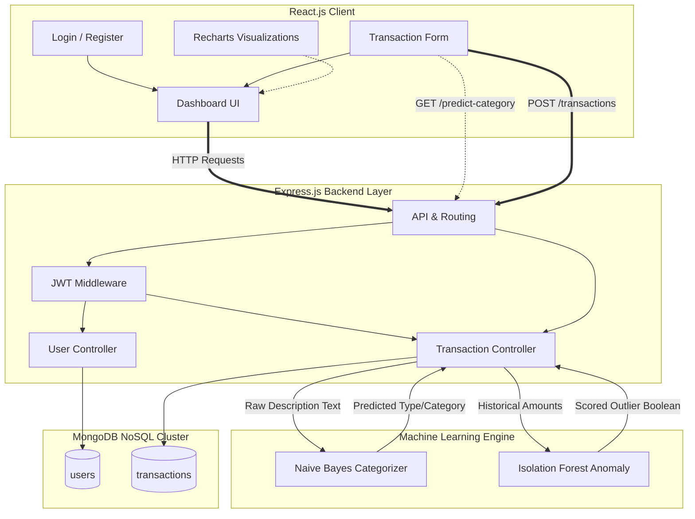

# ExpenseIQ Architecture Diagram

ExpenseIQ is built on the MERN stack (MongoDB, Express.js, React, Node.js), integrating sophisticated backend AI processing pipelines via REST APIs. 

Below is the systemic Mermaid flow covering the User's traversal from the Single Page Application (SPA), through to the Node runtime environment where the NLP and Isolation Forest machine learning tasks execute before reaching the MongoDB collections.

## Scaling Strategy
The frontend is decoupled and deployable instantly on Vercel Native Edge routing. The backend Node server can be efficiently Dockerized to run on Render or AWS ECS due to its strictly stateless architecture and scalable standard JWT token verification patterns without requiring synchronized server memory caches.
